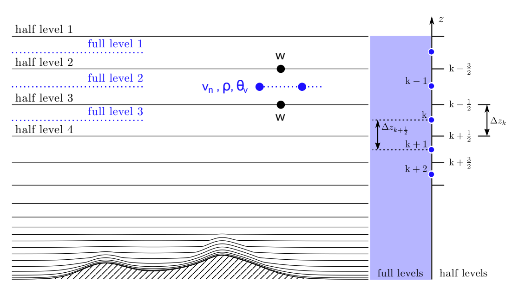
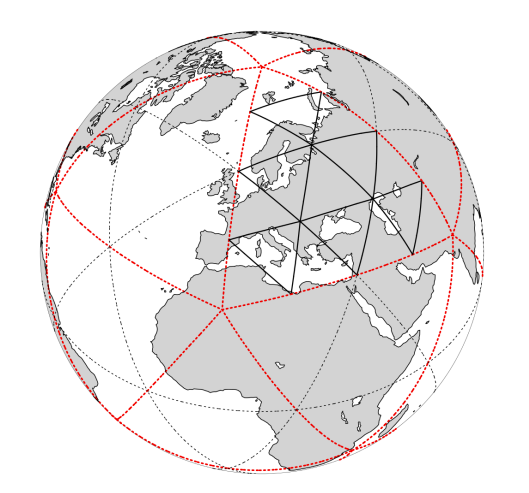

[MeteoSwiss - Open Data](https://github.com/MeteoSwiss/opendata/blob/main/README.md) > [Understanding MeteoSwiss' Open Data products](https://github.com/MeteoSwiss/opendata/blob/main/README.md#understanding-meteoswiss-open-data-products) > E. Forecast Data

# E. Forecast Data
[Forecasting systems](https://www.meteoswiss.admin.ch/weather/warning-and-forecasting-systems.html) calculate future atmospheric conditions on the basis of measurement data and observations. MeteoSwiss uses these weather models to create weather forecasts and to enable it to issue weather warnings in the event of imminent hazards.

The following forecast data are available:

1. [Short-term forecast data](#1-short-term-forecast-data) :yellow_circle: *documentation upcoming*
2. [Numerical weather forecasting model data](#2-numerical-weather-forecasting-model-data) :yellow_circle: *documentation upcoming*
3. [Local forecast data](#3-local-forecast-data) :yellow_circle: *documentation upcoming*

<br>

---

## 1. Short-term forecast data
[Nowcasting](https://www.meteoswiss.admin.ch/weather/warning-and-forecasting-systems/nowcasting.html) involves high spatial and temporal resolution forecasts of weather developments for the next few minutes and up to a maximum of six hours ahead. MeteoSwiss uses these short-term forecasts to, among other things, predict thunderstorms, hail and heavy rainfall.

As MeteoSwiss is planning to replace the current 'INCA' nowcasting software, the following datasets are available from the start of our open data provision:
- **Precipitation (10min values): quantitative chain (based on CombiPrecip, RR)**
- **Wind, wind gust and wind direction (10min values)**
- *Relative sunshine duration* (10min values)
- **Total cloudiness (10min values)**

The following datsets will be provided next:
- **Snowfall (10min values): quantitative chain (based on CombiPrecip, RS)**
- ...
- ...

### 1.1. Data granularity, update frequency, format and volume
Data granularity is every 10min. Update frequency for the period 0h- +6h is specified per dataset in the table below.

Data format is [`NetCDF`](https://www.unidata.ucar.edu/software/netcdf).

| Dataset | Update frequency | Example data file | Productive version file name | Estimated volume per file (MB) |
|:----- | ----- |:----- |:----- | ----- |
| **Precipitation (10min values): quantitative chain (based on CombiPrecip, RR)** | every 10min | [RR_INCA_202106280700.nc](https://github.com/MeteoSwiss/publication-opendata-inca-data-nowcasting/blob/main/RR_INCA_202106280700.nc) | `ogd-nowcasting_RR-INCA_(date and time code).nc` | 1.7 |
| **Wind, wind gust and wind direction (10min values)** | every 10min | [...](...) | `ogd-nowcasting_(product name)_(date and time code).nc` | ... |
| *Relative sunshine duration* (10min values) | 10min | [SU_INCA_202106280700.nc](https://github.com/MeteoSwiss/publication-opendata-inca-data-nowcasting/blob/main/SU_INCA_202106280700.nc) | `ogd-nowcasting_SU-INCA_(date and time code).nc` | 6.4 |
| *Total cloudiness* (10min values) | 10min | [SU_INCA_202106280700.nc](https://github.com/MeteoSwiss/publication-opendata-inca-data-nowcasting/blob/main/SU_INCA_202106280700.nc) | `ogd-nowcasting_SU-INCA_(date and time code).nc` | 6.4 |
|       |       |       |       |       |
| **Snowfall (10min values): quantitative chain (based on CombiPrecip, RS)** | every 10min | [RS_INCA_202106280700.nc](https://github.com/MeteoSwiss/publication-opendata-inca-data-nowcasting/blob/main/RS_INCA_202106280700.nc) | `ogd-nowcasting_RS-INCA_(date and time code).nc` | 0.4 |

### 1.2. Parameter metadata
Parameter metadata is part of each NetCDF-File. See example data files in the table above.

<!-- ### Codes -->
<!-- ... -->

### 1.3. Coordinate system
The coordinate system is Swiss LV95 EPSG:2056.

### 1.4. Data visualisation
See e.g. MeteoSwiss' [...](...).

<br>

## 2. Numerical Weather Forecasting Model Data

MeteoSwiss uses two models, **ICON-CH1-EPS** and **ICON-CH2-EPS**, to forecast atmospheric changes in Switzerland and its surroundings over a longer period than nowcasting, providing predictions for up to five days. Both models include
[ensemble data assimilation](https://www.meteoswiss.admin.ch/weather/warning-and-forecasting-systems/icon-forecasting-systems/ensemble-data-assimilation.html).

The documentation covers the following topics:
- [2.1 Model Specifications](#21-model-specifications)
- [2.2 Available Parameters](#22-available-parameters)
- [2.3 Accessing Forecast Data](#23-accessing-forecast-data)
- [2.4 3D Grid Structure and Representation](#24-3d-grid-structure-and-representation)
- [2.5 Accessing Static Grid Information: Height, Longitude, and Latitude](#25-accessing-static-grid-information-height-longitude-and-latitude)
- [2.6 Data Visualisation](#26-data-visualisation)
- [2.7 Accessing REST API](#27-accessing-rest-api)

### 2.1 Model Specifications

| **Attributes**| **ICON-CH1-EPS** | **ICON-CH2-EPS**|
|-----------|------------------|-----------------|
| Collection |[ch.meteoschweiz.ogd-forecasting-icon-ch1](https://sys-data.int.bgdi.ch/browser/#/collections/ch.meteoschweiz.ogd-forecasting-icon-ch1?.language=en) | [ch.meteoschweiz.ogd-forecasting-icon-ch2](https://sys-data.int.bgdi.ch/browser/#/collections/ch.meteoschweiz.ogd-forecasting-icon-ch2?.language=en) |
| Horizontal Grid Size | 1 km | 2.1 km |
| Ensemble Members | 11 | 21 |
| Forecast Period | 33 h | 120 h |
| Grid | Native icosahedral | Native icosahedral |
| Temporal Resolution |  1 h | 1 h |
| Model Run Interval | every 3 h | every 6 h |
| Format | GRIB edition 2 | GRIB edition 2 |


### 2.2 Available Parameters

Users can find information about available parameters, including metadata, in the collection level assets of the above collections.

#### 2.2.1 Parameter Metadata

The parameter metadata is part of each GRIB file.


### 2.3 Accessing Forecast Data

Users can access forecast model data from the last **24 hours**. Data older than this is no longer available. The data in each collection is described in the [Model Specification table](###2.1-model-specification).

#### 2.3.1 Forecast Data Volume

The following tables summarize the volume of the different forecast files for **ICON-CH1** and **ICON-CH2**.

**ICON-CH1 Data Volume**
| | Single-Level Files| Multi-Level Files|
|-----------|------------------|-----------------|
| Deterministic| 2.1 - 2.2 MiB| 74.5 - 177.4 MiB|
| Perturbed | 21.9 - 22. 5 MiB | 1.3 - 1.7 GiB |


**ICON-CH2 Data Volume**
| | Single-Level Files| Multi-Level Files|
|-----------|------------------|-----------------|
| Deterministic| 509.2 - 558.0 KiB| 17.9 - 43.9 MiB|
| Perturbed | 10.0 - 10-9 MiB | 360.9 - 877.5 MiB |


### 2.4 3D Grid Structure and Representation
The model data is structured on both a horizontal and vertical grid. While some parameters extend across the entire three-dimensional grid, others are only available at specific vertical levels.
Parameters are classified as either **single-level** or **multi-level**:
- **Single-level parameters** contain data at a specific vertical level.
- **Multi-level parameters** extend across multiple vertical layers.

For example, vertical velocity is stored at multiple vertical levels, while the two-meter temperature is available only at a single vertical level.


#### 2.4.1 Vertical Grid

The vertical grid is a height based coordinate system that follows the terrain. It is divided into multiple layers. The closer the layer is to
the surface, the narrower the layers are, as shown in the image below.
The so-called half levels align with horizontal grid points, while the full levels represent an averaged value over a vertical interval.
There are 81 discrete half levels and 80 full levels in our data.

<div align=center>


Illustration of ICON's vertical levels, Working with the ICON Model 2024, Figure 3.2
</div>

All parameters have their information on full levels, except for the vertical velocity W. W is stored on half levels and therefore called staggered.
This means that the value is exact in this point
and not an avarage value over a layer stored in one point like the full levels. For more detailed information on the vertical grid, read section 3.4 in [Working with the ICON Model](https://www.dwd.de/DE/leistungen/nwv_icon_tutorial/pdf_einzelbaende/icon_tutorial2024.pdf?__blob=publicationFile&v=3).

#### 2.4.2 Horizontal Grid

The horizontal grid of ICON-CH1-EPS and ICON-CH2-EPS model is based on a native icosahedral grid inherited by the original ICON model grid (illustrated below).

<div align=center>


Illustration of the grid construction, Working with the ICON Model, Figure 2.1
</div>

Since the provided data is given in the native grid, note that the grid points correspond to the **center of the circumcircle of each triangle** and **not** to the vertices. Therefore, the longitude and latitude are based in the middle of each triangle on the grid mentioned before. For more detailed information on
the horizontal grid, read section 2.1 in [Working with the ICON Model](https://www.dwd.de/DE/leistungen/nwv_icon_tutorial/pdf_einzelbaende/icon_tutorial2024.pdf?__blob=publicationFile&v=3).

### 2.5 Accessing Static Grid Information: Height, Longitude, and Latitude

Besides the current forecasting files, each catalog contains two static files. They store permanent information about the height of the half levels (HHL) in the vertical grid and
the center point coordinates of each triangle (CLON/CLAT) on the horizontal grid. Note that the forecasting GRIB files contain no information on height, longitude and latitude. They have to be determined via the static files HHL and CLON/CLAT.

#### 2.5.1 How to access the height of a grid point

In the static HHL file one can obtain the height of the half levels of the vertical grid in meters above see level. In order to point a value from the data file of a wanted parameter to a specific height, follow the steps below.
- Check if the `UUID` (Universally Unique Identifier) of the data file and the HHL file match.
- Then, use the `scaledValueOfFirstFixedSurface` value to retrieve the height in meter above see level of the HHL file.

#### 2.5.2 How to access the longitude and latitude of a grid point

The CLON/CLAT file stores the longitude and latitude of the center points of each triangle on the horizontal grid.
### 🚧  **Temporary Notice Work in Progress **
When opening a data set in a jupyter notebook the load function includes fetching the CLON/CLAT values. To retrieve CLON/CLAT without a python environment, see section 2.7.


### 2.6 Data Visualisation

See [jupyter-notebook examples]().

### 2.7 Retrieving Forecasts via REST API

If users prefer not to use the provided library to load the data, they can retrieve datasets directly via the [REST API](https://sys-data.int.bgdi.ch/api/stac/static/spec/v1/apitransactional.html#tag/Data/operation/getAsset) by following the step-by-step instructions in this section to obtain forecast data for specific models, variables, and other customizable parameters.

#### 2.7.1 Submitting a POST Request

Filtering and querying forecast data must be done using a **POST** request. To retrieve a forecast, prepare a JSON request payload. Below is an example request body:

```
{
    "collections": [
        "ch.meteoschweiz.ogd-forecasting-icon-ch2"
    ],
    "forecast:reference_datetime": "2025-03-12T12:00:00Z",
    "forecast:variable": "TOT_PREC",
    "forecast:perturbed": false,
    "forecast:horizon": "P0DT00H00M00S"
}
```

Each parameter serves the following purpose:
- `collections`: Defines the forecast model to use (`ICON-CH1-EPS` or `ICON-CH2-EPS`).
- `forecast:reference_datetime`: Specifies the desired forecast initialization time (e.g., `2025-03-12T12:00:00Z`).
- `forecast:variable`: Indicates the meteorological parameter of interest (`TOT_PREC` for total precipitation, for example).
- `forecast:perturbed`: Boolean flag determining if the data is deterministic (`false`) or ensemble-based.
- `forecast:horizon`: Defines the lead time of the forecast (`P0DT00H00M00S` for instant data).

#### 2.7.2 Sending the Request
Using a tool like `curl`, send the request to the API endpoint:
```
curl -X POST "https://sys-data.int.bgdi.ch/api/stac/v1/search" \
     -H "Content-Type: application/json" \
     -d @request.json
```

Alternatively, in Visual Studio Code, install the `REST Client` extension and create an `.http` file with the following content:
```
POST https://sys-data.int.bgdi.ch/api/stac/v1/search
Content-Type: application/json

{
    "collections": [
        "ch.meteoschweiz.ogd-forecasting-icon-ch2"
    ],
    "forecast:reference_datetime": "2025-03-12T12:00:00Z",
    "forecast:variable": "TOT_PREC",
    "forecast:perturbed": false,
    "forecast:horizon": "P0DT00H00M00S"
}
```
#### 2.7.3 Downloading the Forecast Data
Upon a successful request, the response will contain a dictionary of metadata, including forecast file links under the assets key. Locate the href field containing the pre-signed URL.
Download the GRIB file using the following command:
```
wget -O <name_of_the_forecast> “<presigned URL>”
```
Once downloaded, proceed with decoding the GRIB file using the instructions in Section 2.7.4 Decoding GRIB Files with ecCodes.

#### 2.7.4 Installing ecCodes and COSMO definitions

Once you have a GRIB file, you need a tool to read it. We recommend installing ecCodes from ECMWF.
By default, the GRIB file shows the short names defined by ECMWF. However, the ICON model has its own definitions.
In order to install them, apply the steps below.

- Clone the GitHub repository [eccodes-cosmo-resources](https://github.com/COSMO-ORG/eccodes-cosmo-resources) into folder *nameOfYourFolder*.
- Clone the github repository [ecmwf/eccodes](https://github.com/ecmwf/eccodes/) into the same folder *nameOfYourFolder*.

⚠️ **WARNING**: Make sure both repositories are in the same folder and run on the same version.

Finally, execute the following command to set the GRIB definition path:


```
export GRIB_DEFINITION_PATH=pathToNameOfYourFolder/eccodes-cosmo-recources/definitions:pathToNameOfYourFolder/eccodes/definitions
```

❗ **NOTE**: This command must be executed every time you start a new terminal session.

#### 2.7.5 Decoding GRIB Files with ecCodes

This section provides a brief introduction to decoding GRIB files using **ecCodes**.
For more details, refer to the [ECMWF ecCodes documentation](https://events.ecmwf.int/event/363/contributions/4110/attachments/2346/4098/intro_grib_decoding_2023-10-31.pdf).

Use the following commands to
- Check ecCodes installation details:
```
codes_info
```

- List all the GRIB messages in a file:
```
grib_ls filename.grib
```

- Filter GRIB messages based on key-value conditions:
```
grib_ls -w key1=value1,key2=value2 filename.grib
```

- Specify a list of keys to be printed:
```
grib_ls -p key1,key2 filename.grib
```

- Get a detailed view of the content of all GRIB messages:
```
grib_dump filename.grib
```
- Get a detailed view of GRIB messages with filters:
```
grib_dump -w key1=value1,key2=value2 filename.grib
```

⚠️ **WARNING**: Some variables in the ICON model are not included in the WMO standard definitions but are instead defined in ICON's local GRIB definitions. If a variable is missing, users should check the [eccodes-cosmo-resources files](https://github.com/COSMO-ORG/eccodes-cosmo-resources/blob/master/definitions/grib2/localConcepts/edzw/shortName.def).

<br>

## 3. Local forecast data
...

...

### Data granularity, update frequency, format and volume
There are files of [data granularity](https://github.com/MeteoSwiss/opendata-download?tab=readme-ov-file#data-granularity) `...`, `...`, `...`, `...` *and [update frequency](https://github.com/MeteoSwiss/opendata-download/blob/main/README.md#update-frequency) hourly (`now`), daily (`recent`) or yearly (`historical`) for each station*.

Data format is [`CSV`](https://github.com/MeteoSwiss/opendata-download?tab=readme-ov-file#column-separators-decimal-dividers-and-missing-values) with an estimated volume of ... MB per file.

See example data files: [`...`](...).

### Parameter metadata
See example parameter metadata files of [data granularity](https://github.com/MeteoSwiss/opendata-download?tab=readme-ov-file#data-granularity): [`...`](...) and [`...`](...).

<!-- ### Codes -->
<!-- ... -->

### Station metadata
See example [station metadata file](...).

### Data visualisation
See e.g. MeteoSwiss' [...](...).

<br>
